# AFU · Console

Tarayıcıda çalışan bir oyun konsolu arayüzü. Gerçek PS5 oyunları (IGDB), çalışan bir demo mağaza, kupalar, kontrol merkezi,
ayarlar ve arama; hepsi gerçekten çalışıyor. "İşe alım" kullanıcısı ise CV'yi ve GitHub projelerimi görür.
Klavye, fare, dokunmatik ekran ve oyun kumandasıyla (DualSense, Xbox ve diğerleri) gezilir.

Next.js + TypeScript, iki dilli (TR/EN). Projede tek bir ses, logo veya ikon dosyası yok: sesler ve müzik Web Audio ile
tarayıcıda sentezleniyor; oyun görselleri IGDB'den, depo kartları GitHub'dan geliyor.


## Öne çıkanlar

- **Konsol akışı:** açılış animasyonu → "Kumandayı kim kullanıyor?" → ana ekran. Dinlenme modu, kapatma ve yeniden başlatma dahil.
- **Gerçek oyunlar:** kapaklar, arka plan görselleri, ekran görüntüleri, tür, puan, geliştirici ve yayıncı IGDB'den gelir.
- **Ana ekran:** Oyunlar / Medya sekmeleri, büyüyen seçili kutucuk, arka planda yumuşakça değişen görsel. Seçili oyunun
  türü, yılı, puanı, kısa tanıtımı ve künyesi (geliştirici, çıkış tarihi, yayıncı, oyun modları); aşağıda Aktiviteler kartları.
  Kutucuk birkaç saniye seçili kalınca oyunun fragmanı arka planda sessizce oynar (oyun sayfasında da).
- **PlayStation Store:** vitrin; ad, tür, etiket ya da stüdyoya göre arama, tür filtreleri, kendiliğinden dönen öne çıkanlar
  bandı, en yüksek puanlılar ve yakında çıkacaklar. Satın alma onay penceresiyle çalışır,
  alınan oyun kütüphaneye eklenir. Demo: ödeme bilgisi istenmez, fiyatlar temsilidir.
- **Oyun sayfası:** fragman (konsolun içinde, sesli oynatıcıda), PlayStation Store bağlantısı, aktiviteler, hakkında, etiketler ve galeri.
- **Kontrol merkezi:** konsoldaki simge çubuğu (Ana ekran, Değiştirici, Bildirimler, İletişim, Müzik, Erişilebilirlik, Ses, Güç) ve her simgenin üstünde açılan kart.
- **Ayarlar uygulaması:** kategori listesi, solda bölümler, sağda ayarlar. Anahtarlar, kaydırıcılar, seçim listeleri ve onay pencereleri.
- **Arama:** tam ekran arama, sonuç satırları ve kumandayla kullanılan ekran klavyesi. Mağazadaki oyunları da bulur.
- **Kupalar:** ziyaretçinin gezerken kazandığı 10 konsol kupası (açılır bildirim ve kupa sesiyle).
- **İşe alım profili:** yalnızca "İşe alım" kullanıcısında; GitHub profil fotoğrafı, hakkımda, teknolojiler ve GitHub projeleri.
- **Müzik:** sentezlenen arka plan parçaları; seçili oyunun kutucuğunda o oyuna özel bir tema çalar.
- **Kumanda:** Gamepad API ile yön tuşları, çubuklar, L1/R1, Options, Create ve PS tuşu; destekleyen kumandalarda titreşim.
- **Oluştur menüsü:** bağlantıyı kopyala, paylaş (Web Share), tam ekran.
- **Telefon düzeni:** dikey ekranda kendine özgü yerleşim, kaydırma hareketleri ve alt sayfa (bottom sheet) kontrol merkezi.

## Ekranlar

| | |
| --- | --- |
|  |  |
| **Açılış.** Bir tuşa basınca güç açılma sesi ve ışık patlaması. | **Kullanıcı seçimi.** İşe alım doğrudan profile ve GitHub projelerine gider. |
|  |  |
| **Ana ekran.** Seçili oyunun türü, puanı, tanıtımı ve künyesi. | **Aktiviteler.** Çıkış tarihi, yayıncı, oyun modları ve puan; arkada ekran görüntüleri. |
| 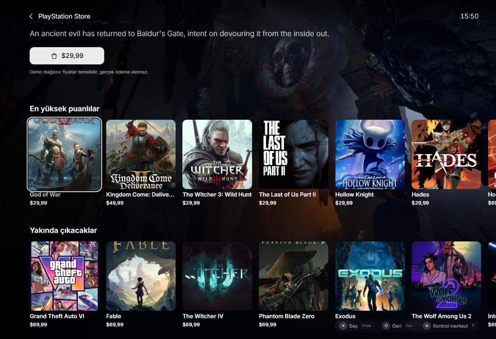 | 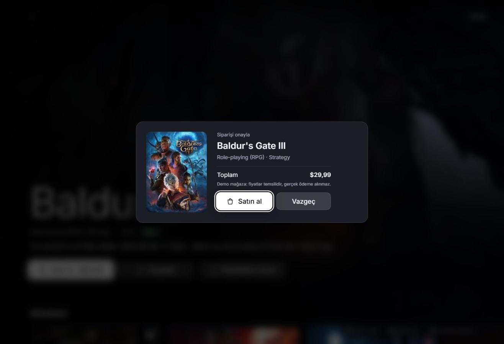 |
| **PlayStation Store.** En yüksek puanlılar ve yakında çıkacaklar. | **Satın alma.** Demo onay penceresi; ödeme bilgisi istenmez. |
| 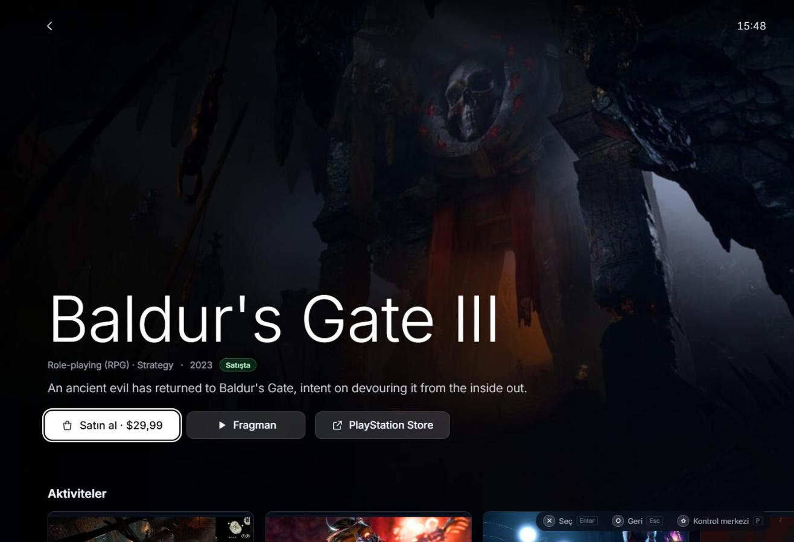 | 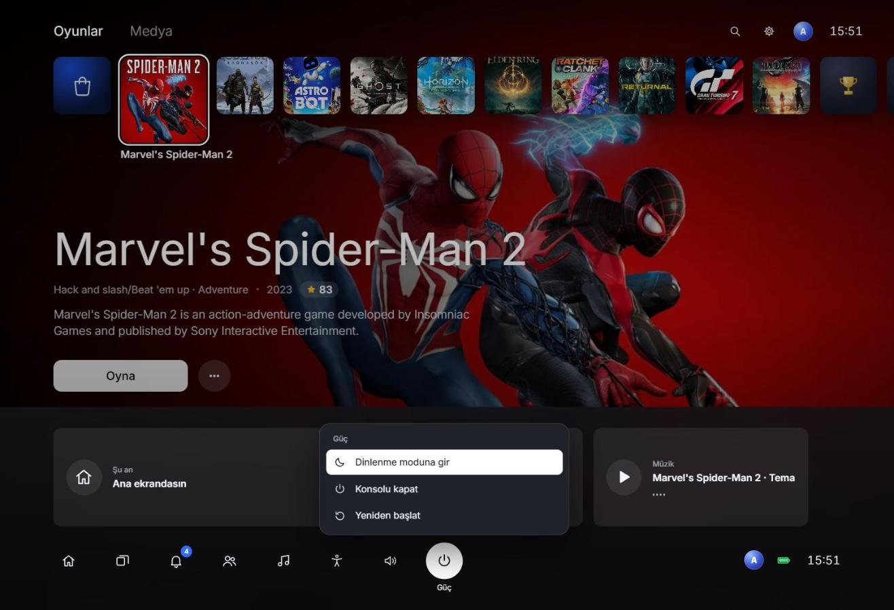 |
| **Oyun sayfası.** Satın al, fragman ve PlayStation Store bağlantısı. | **Kontrol merkezi.** Güç kartı açıkken; bildirimler ve müzik kartı. |
| 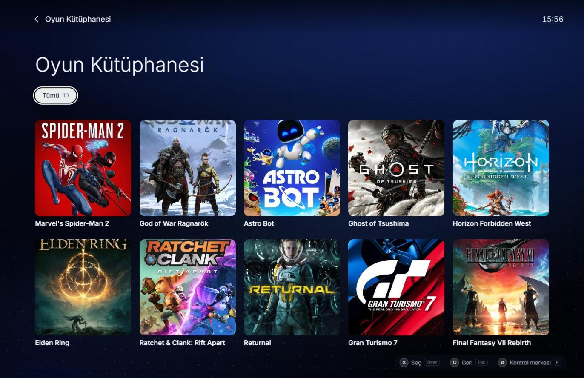 |  |
| **Oyun Kütüphanesi.** Sahip olunan oyunlar. | **Arama.** Ekran klavyesi; mağazadaki oyunları da bulur. |
| 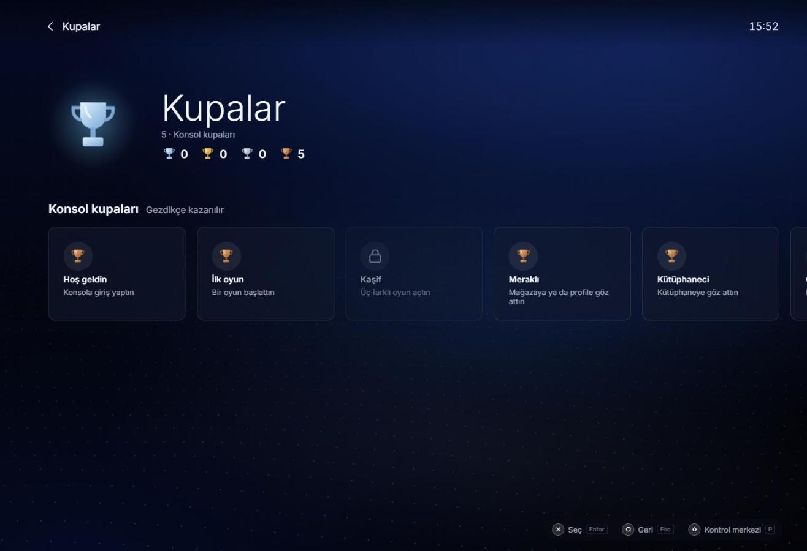 |  |
| **Kupalar.** Gezdikçe kazanılan konsol kupaları. | **Medya.** Instagram, GitHub, LinkedIn, e-posta ve web sitesi. |
| 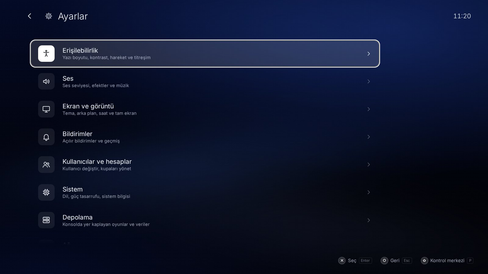 | 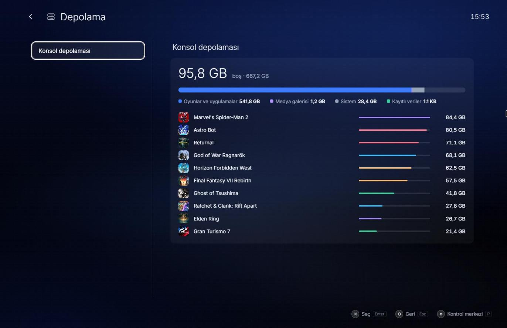 |
| **Ayarlar.** Dokuz kategori, hepsi çalışıyor. | **Depolama.** Yüklü oyunlar ve kapladıkları yer. |
| 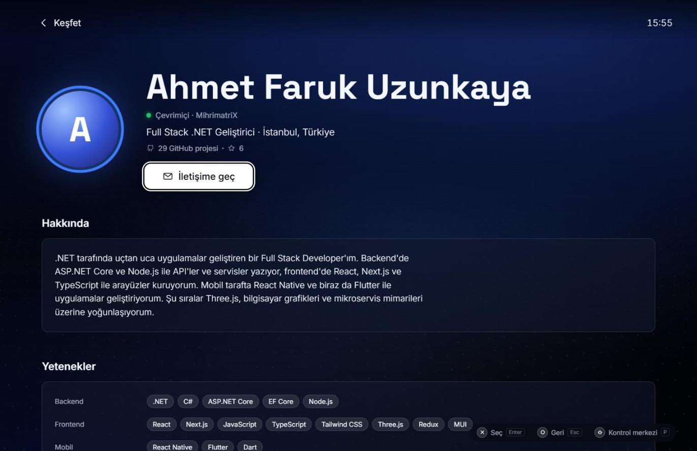 | 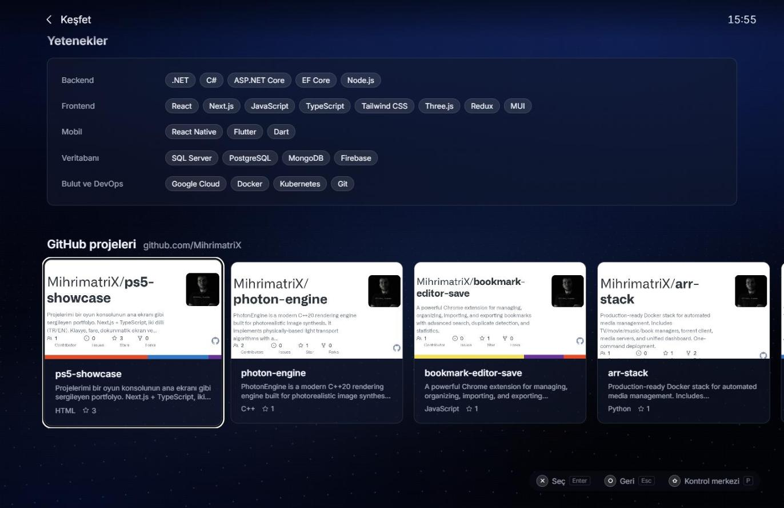 |
| **Profil (İşe alım).** Hakkımda ve teknolojiler, GitHub profilinden. | **GitHub projeleri.** Herkese açık depolar, kart görselleriyle. |
|  | 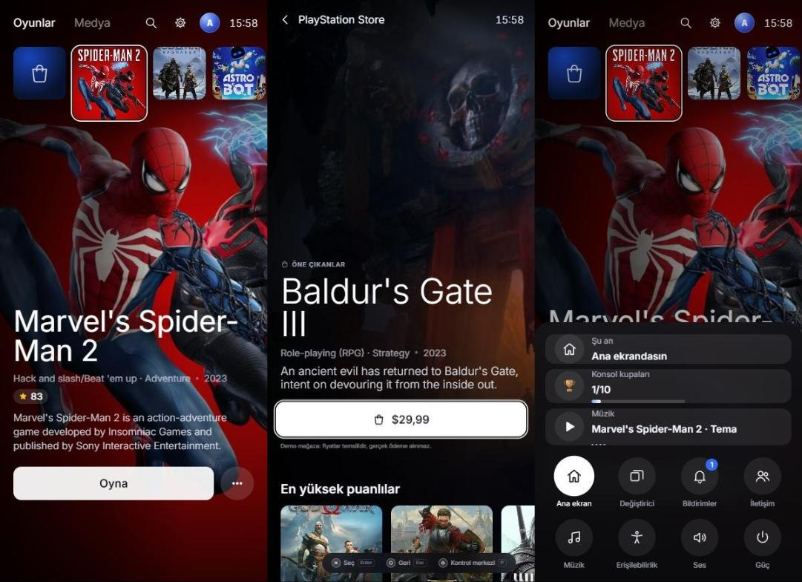 |
| **Aksesuarlar.** Canlı kumanda şeması; basılan tuşlar yanar. | **Telefonda.** Ana ekran, mağaza ve alt sayfa kontrol merkezi. |

## Konsoldaki karşılıkları

| Konsolda | Burada |
| --- | --- |
| Açılış ve "Kumandayı kim kullanıyor?" | Misafir ve Sahip konsolu görür; İşe alım doğrudan profile gider |
| Oyunlar sırası | PlayStation Store, sahip olunan oyunlar (son alınan başta), Kupalar, Oyun Kütüphanesi |
| Oyun sayfası | Satın al / fragman / PlayStation Store, aktiviteler, hakkında, etiketler, galeri |
| PlayStation Store | IGDB'nin en yüksek puanlı ve en çok beklenen PS5 oyunları, demo satın alma |
| Keşfet / Profil | Yalnızca İşe alım: hakkımda, teknolojiler, GitHub projeleri |
| Kupalar | Ziyaretçinin gezerken kazandığı konsol kupaları |
| Oyun Kütüphanesi | Sahip olunan oyunlar, duruma göre filtreli |
| Medya | Instagram, GitHub, LinkedIn, e-posta ve web sitesi |
| Kontrol merkezi | Son açılan oyunlar, bildirimler, iletişim, müzik, erişilebilirlik, ses, güç |
| Ayarlar | Erişilebilirlik, ses, ekran, bildirimler, kullanıcılar, sistem, depolama, ağ, aksesuarlar |
| Arama | Oyunlar ve bağlantılar arasında arama |
| Oluştur (Create) tuşu | Bağlantıyı kopyala, paylaş, tam ekran |

## Kontroller

| | Klavye | Kumanda | Dokunmatik |
| --- | --- | --- | --- |
| Gezin | Oklar / WASD | Yön tuşları, sol çubuk | Kaydır |
| Seç | Enter / Boşluk | ✕ | Dokun (seçili karoya tekrar dokun) |
| Geri | Esc / Backspace | ○ | Sol üstteki geri oku |
| Kontrol merkezi | P | PS tuşu | Alttaki yuvarlak düğme |
| Seçenekler (oyunun … menüsü) | M | Options | `…` düğmesi |
| Oluştur menüsü | C | Create | |
| Önceki / sonraki sekme | Q / E | L1 / R1 | Sekmeye dokun |
| Ara (ana ekranda) | T | △ | Üstteki büyüteç |

PS tuşunu tarayıcıya iletmeyen kumandalarda (ör. bazı Xbox kumandaları) Options tuşu, kendi menüsü olmayan ekranlarda
kontrol merkezini açar. Fareyle tekerlek de çalışır: ana ekranda aşağı/yukarı kaydırma kartlara iner, yatay kaydırma (veya Shift + tekerlek)
kutucuklar arasında gezer. Ayarlar → Aksesuarlar → Klavye sayfasında aynı tablo konsolun içinde de var.

## Ayarlar

Ayarlar tarayıcıda (`localStorage`) saklanır ve bir sonraki ziyarette geri gelir.

| Kategori | Neler var |
| --- | --- |
| Erişilebilirlik | Yazı boyutu (tüm arayüzü büyütür), yüksek kontrast, hareketi azalt, kumanda titreşimi |
| Ses | Ana ses seviyesi, ses efektleri, sesi test et, arka plan müziği, parça seçimi, oyun temaları |
| Ekran ve görüntü | Sistem teması (Kozmik, Kuzey ışığı, Kor, Gece), fragmanları otomatik oynat, dalga arka planı, tam ekran, 12/24 saat |
| Bildirimler | Açılır bildirimler, bildirim geçmişini temizle |
| Kullanıcılar ve hesaplar | Kullanıcı değiştir, konsol kupalarını sıfırla |
| Sistem | Dil, belirli bir süre sonra ekranı karart, sistem bilgisi, varsayılan ayarlara dön |
| Depolama | Projelerin "yüklü oyun" boyutları ve kayıtlı verilerin kapladığı yer |
| Ağ | Bağlantı durumu, gecikme ölçen internet testi, bağlantı türü |
| Aksesuarlar | Canlı kumanda şeması, titreşim testi, klavye/kumanda tuş tablosu |

## Veri kaynakları

| Dosya | Kaynak | Güncelleme |
| --- | --- | --- |
| `content/games.ts` | IGDB: sahip olunan oyunlar, mağaza kataloğu (en yüksek puanlılar ve yakında çıkacaklar) | `npm run sync:games` |
| `content/github.ts` | GitHub'daki herkese açık depolar (fork ve arşivler hariç) | `npm run sync:github` |
| `content/portfolio.ts` | CV, medya, sosyal bağlantılar | Elle |

Her iki dosya da üretilir ve tip denetiminden geçer; elle düzenlenmez. Anahtarlar `.env.local` içindedir ve git'e girmez:

```bash
CLIENT_ID=...       # dev.twitch.tv/console üzerinden bir uygulama (IGDB, Twitch kimliğiyle çalışır)
CLIENT_SECRET=...
GITHUB_TOKEN=...    # isteğe bağlı; yalnızca saatlik 60 istek sınırını kaldırır
```

Sahip olunan oyunları değiştirmek için `scripts/sync-igdb.mjs` içindeki `TITLES` listesini düzenleyip senkronu çalıştır.

**Canlı arama:** mağaza ve arama, katalogda olmayan oyunları `/api/games?q=` üzerinden IGDB'de arar (PS5 ve PS4; remake,
remaster ve port'lar dahil). Bu rota sunucuda çalışır, anahtarlar tarayıcıya gitmez. Yayına alırken (ör. Vercel) `CLIENT_ID` ve
`CLIENT_SECRET` ortam değişkenlerini orada da tanımla. Sunucusu olmayan `preview/index.html` yalnızca kataloğu arar.
IGDB erişimi ve oyun eşlemesi `lib/igdb.ts` içinde; senkron betiği ve rota aynı kodu kullanır.
Arayüzde gösterilen veriler IGDB'den gelir ("Powered by IGDB.com", Ayarlar → Sistem).

**Demo mağaza:** fiyatlar temsilidir (IGDB fiyat vermez; çıkış tarihine göre 29,99 / 49,99 / 69,99 $), ödeme bilgisi
hiç istenmez. Satın alınan oyunlar bu tarayıcıda saklanır ve ana ekranın başına, kütüphaneye ve depolamaya eklenir.

**Kullanıcılar:** CV, sertifikalar ve CV bağlantısı yalnızca "İşe alım" kullanıcısında görünür. Misafir ve Sahip bir oyun
konsolu görür.

## İçeriği değiştirmek

Elle düzenlenen tek dosya `content/portfolio.ts`:

- `profile`: İşe alım profili. `experience`, `education`, `languages` ve `achievements` boş bırakılırsa bölümleri hiç
  görünmez; `level` ve `cvUrl` verilmezse seviye çubuğu ve "CV'yi indir" düğmesi gizlenir. Yalnızca gerçek bilgi gir.
- `media`: yazılar ve konuşmalar (şu an boş). `socials`: Medya sekmesindeki ve kontrol merkezindeki bağlantılar.

Oyunlar ve GitHub projeleri bu dosyada değil; senkron betikleriyle üretilir (yukarıdaki "Veri kaynakları").

## Çalıştırma

```bash
cd ps5-showcase
npm install
npm run dev        # http://localhost:3100
npm run typecheck
npm run build
npm run preview    # preview/index.html: kurulum gerektirmeyen tek dosyalık sürüm
npm run sync:games  # IGDB'den oyunları ve mağazayı yenile
npm run sync:github # GitHub depolarını yenile
```

`preview/index.html` tarayıcıda doğrudan açılabilir; içeriği değiştirdikten sonra `npm run preview` ile yenile.

Bu klasör kökteki blogdan bağımsızdır. Vercel'de ayrı bir proje olarak yayınlamak için "Root Directory" olarak `ps5-showcase` seçilir.

## Proje yapısı

```
app/                    Next.js giriş noktası ve tüm stiller (globals.css)
components/
  Console.tsx           Ekranlar arası geçiş, geri yığını, oyun açılış animasyonu
  Overlays.tsx          Kontrol merkezi, Oluştur menüsü, ekran karartma, bağlantı açılış ekranı
  screens/              Home, Pages (oyun, mağaza, profil, kupalar, kütüphane), Settings, Search, System (açılış, kullanıcılar, güç)
  CoverArt.tsx          Paletten üretilen SVG kapak sanatı
  Icons.tsx, ui.tsx     İkonlar ve ortak parçalar
content/portfolio.ts    Elle yazılan içerik (CV, medya, bağlantılar)
content/games.ts        IGDB'den üretilen oyunlar ve mağaza
content/github.ts       GitHub'dan üretilen depolar
scripts/sync-*.mjs      Bu iki dosyayı üreten senkron betikleri
lib/
  console.tsx           Ayarlar, kupalar, bildirimler (localStorage'a kaydedilir)
  input.tsx             Klavye, fare, dokunmatik ve kumanda için tek girdi modeli
  sound.ts              Web Audio ile sentezlenen sesler ve müzik
  nav.ts, i18n.ts       Izgara odaklama ve çeviriler
```

## Teknik notlar

- **Girdi katmanları:** her ekran ve açılır pencere bir katman kaydeder; tuşları yalnızca en üstteki alır. Arama ekranı
  katmanı yazı da alır, böylece aynı ekran hem ekran klavyesiyle hem fiziksel klavyeyle çalışır.
- **Ses:** gezinme, seçim, açılış ve kupa sesleri, ayrıca arka plan müziği tamamen osilatör ve üretilmiş yankıyla yapılır.
  Oyun temaları oyunun kimliğinden türetilen bir akorla çalar, yani her oyun her zaman aynı tınlar.
- **Ölçek:** tüm boyutlar 16:9'a göre ayarlanan tek bir birimle (`--u`) verilir; arayüz TV gibi ölçeklenir,
  "Büyük yazı" ayarı bu birimi büyütür. Telefonlar için ayrı ölçüler var.
- **Kalıcılık:** ayarlar, kazanılan kupalar, son açılan oyunlar ve mağazadan alınanlar `localStorage`'da tutulur; depolama kapalıysa uygulama yine çalışır.
