# AFU · Console

Projelerimi bir oyun konsolunun ana ekranı gibi sergileyen portfolyo. Açılış ekranı, kullanıcı seçimi, oyun kutucukları,
kontrol merkezi, ayarlar, arama, kupalar ve kütüphane; hepsi gerçekten çalışıyor. Klavye, fare, dokunmatik ekran ve
oyun kumandasıyla (DualSense, Xbox ve diğerleri) gezilir.

Next.js + TypeScript, iki dilli (TR/EN). Projede tek bir ses, logo veya ikon dosyası yok: sesler ve müzik Web Audio ile
tarayıcıda sentezleniyor, kapak görselleri her projenin renk paletinden SVG olarak üretiliyor.

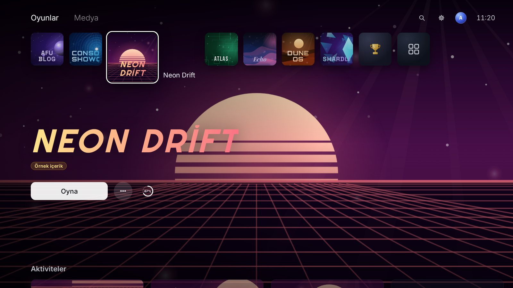

## Öne çıkanlar

- **Konsol akışı:** açılış animasyonu → "Kumandayı kim kullanıyor?" → ana ekran. Dinlenme modu, kapatma ve yeniden başlatma dahil.
- **Ana ekran:** Oyunlar / Medya sekmeleri, büyüyen seçili kutucuk, arka planda yumuşakça değişen kapak sanatı, aşağı inince Aktiviteler kartları.
- **Oyun sayfası:** her proje bir oyun gibi açılır; açıklama, aktiviteler, teknolojiler, proje kupaları ve galeri.
- **Kontrol merkezi:** konsoldaki simge çubuğu (Ana ekran, Değiştirici, Bildirimler, İletişim, Müzik, Erişilebilirlik, Ses, Güç) ve her simgenin üstünde açılan kart.
- **Ayarlar uygulaması:** kategori listesi, solda bölümler, sağda ayarlar. Anahtarlar, kaydırıcılar, seçim listeleri ve onay pencereleri.
- **Arama:** tam ekran arama, sonuç satırları ve kumandayla kullanılan ekran klavyesi. Fiziksel klavye doğrudan yazar.
- **Kupalar:** sertifikalar ve ödüller, ayrıca ziyaretçinin gezerken kazandığı 9 konsol kupası (açılır bildirim ve kupa sesiyle).
- **Müzik:** sentezlenen arka plan parçaları; seçili oyunun kutucuğunda o oyuna özel bir tema çalar.
- **Kumanda:** Gamepad API ile yön tuşları, çubuklar, L1/R1, Options, Create ve PS tuşu; destekleyen kumandalarda titreşim.
- **Oluştur menüsü:** bağlantıyı kopyala, paylaş (Web Share), tam ekran.
- **Telefon düzeni:** dikey ekranda kendine özgü yerleşim, kaydırma hareketleri ve alt sayfa (bottom sheet) kontrol merkezi.

## Ekranlar

| | |
| --- | --- |
| 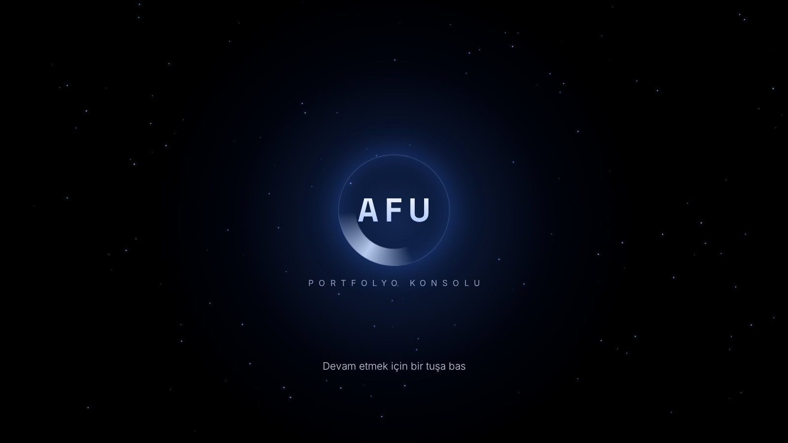 | 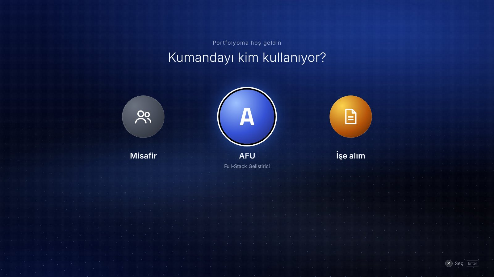 |
| **Açılış.** Bir tuşa basınca güç açılma sesi ve ışık patlaması. | **Kullanıcı seçimi.** İşe alım profili doğrudan CV'ye gider. |
| 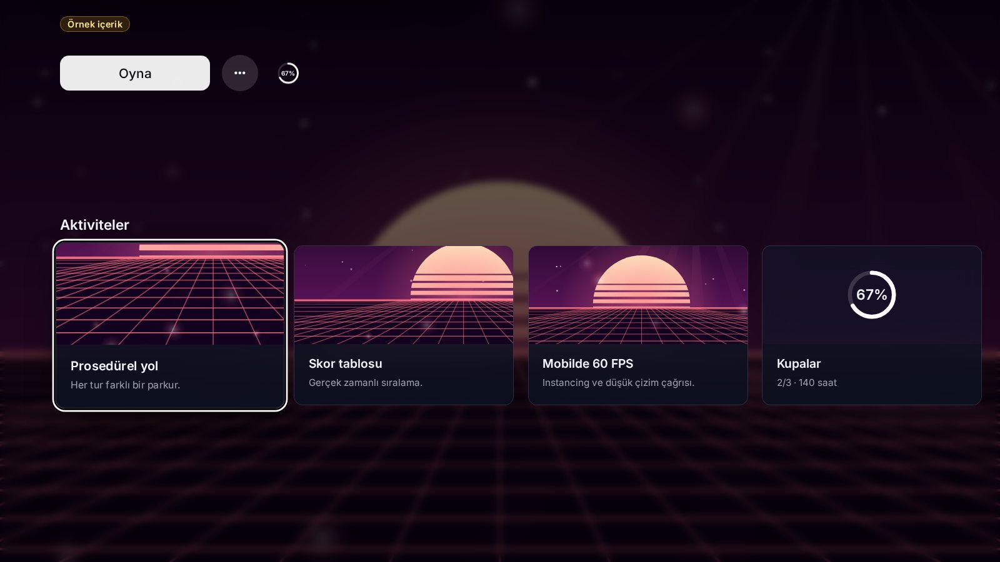 | 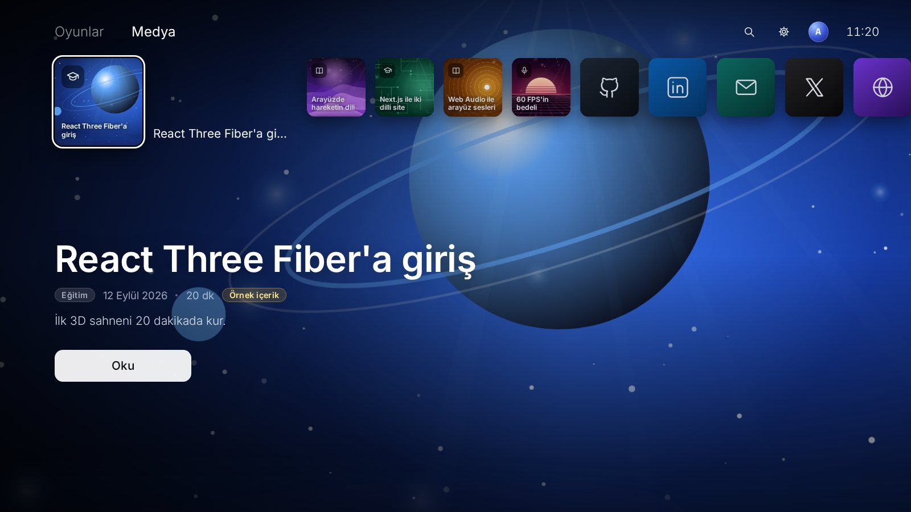 |
| **Aktiviteler.** Aşağı inince projenin öne çıkan özellikleri ve kupa ilerlemesi. | **Medya.** Yazılar, eğitimler ve sosyal bağlantılar. |
| 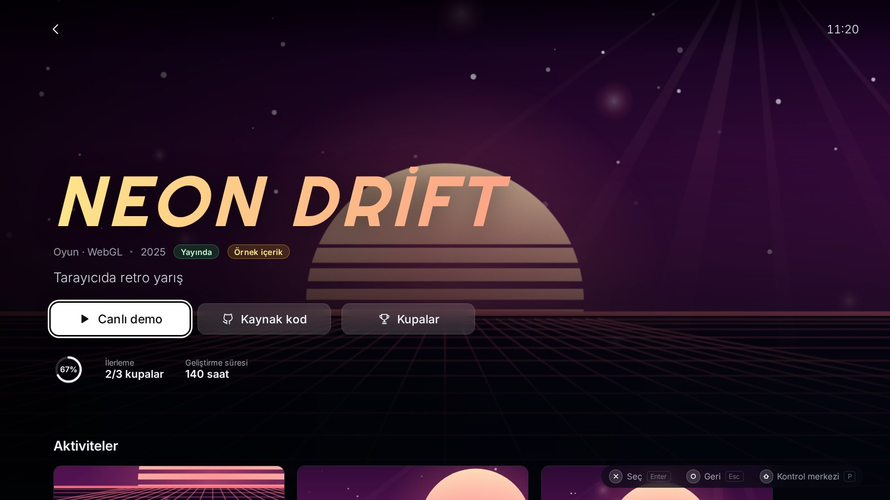 | 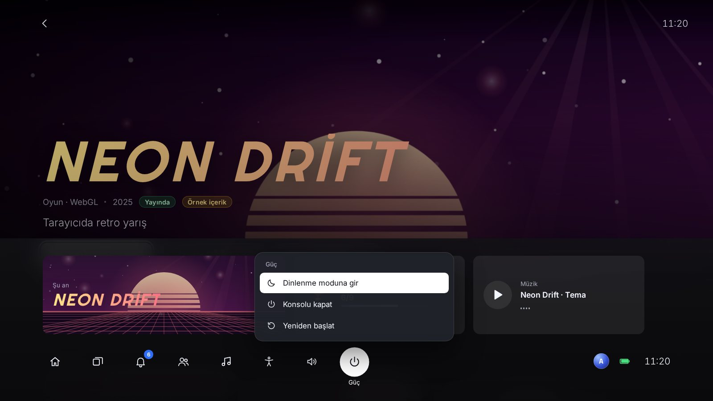 |
| **Oyun sayfası.** Canlı demo, kaynak kod, kupalar ve galeri. | **Kontrol merkezi.** Güç kartı açıkken; okunmamış bildirim rozeti ve müzik kartı. |
|  | 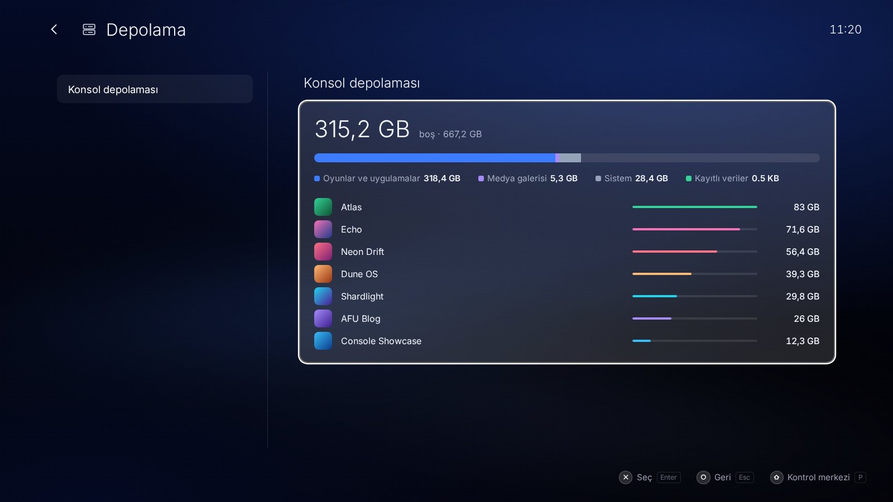 |
| **Ayarlar.** Dokuz kategori, hepsi çalışıyor. | **Depolama.** Projeler "yüklü oyunlar" olarak; boyutları geliştirme süresinden. |
| 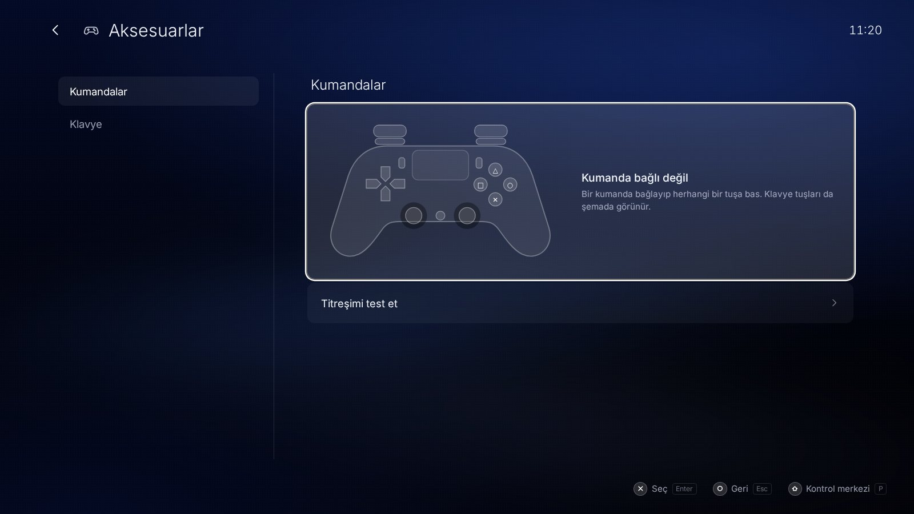 | 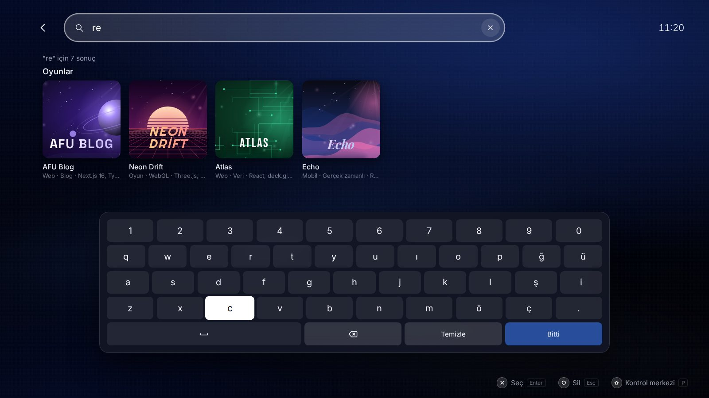 |
| **Aksesuarlar.** Canlı kumanda şeması; basılan tuşlar yanar. | **Arama.** Ekran klavyesi; proje adı, tür veya teknolojiyle arar. |
| 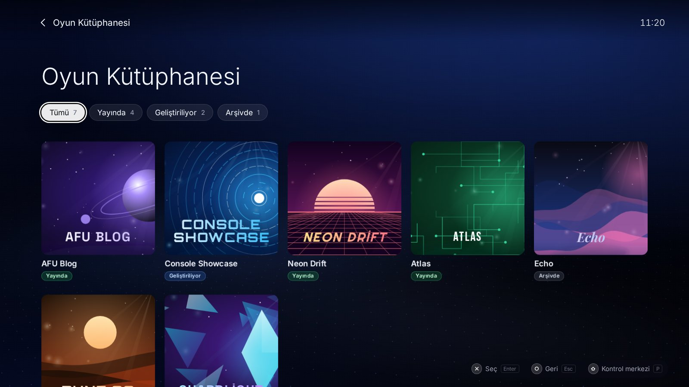 | 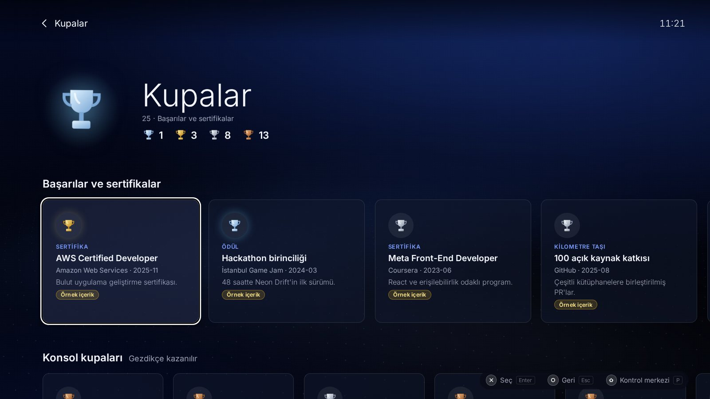 |
| **Oyun Kütüphanesi.** Duruma göre filtre; L1/R1 ile geçiş. | **Kupalar.** Sertifikalar, ödüller ve konsol kupaları. |
| 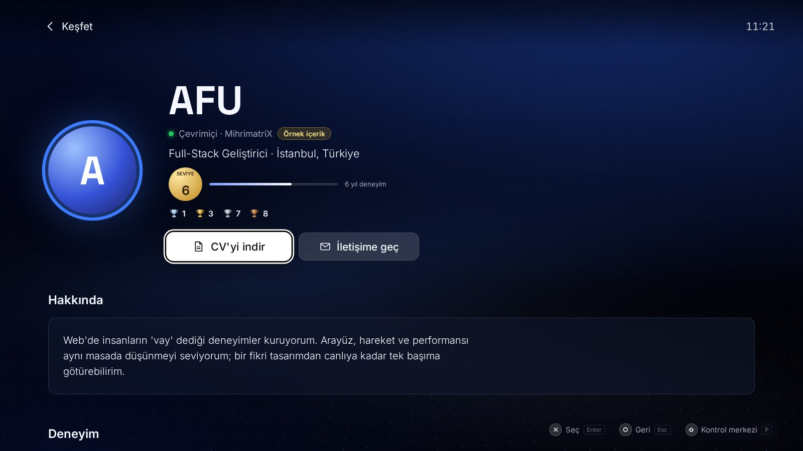 | 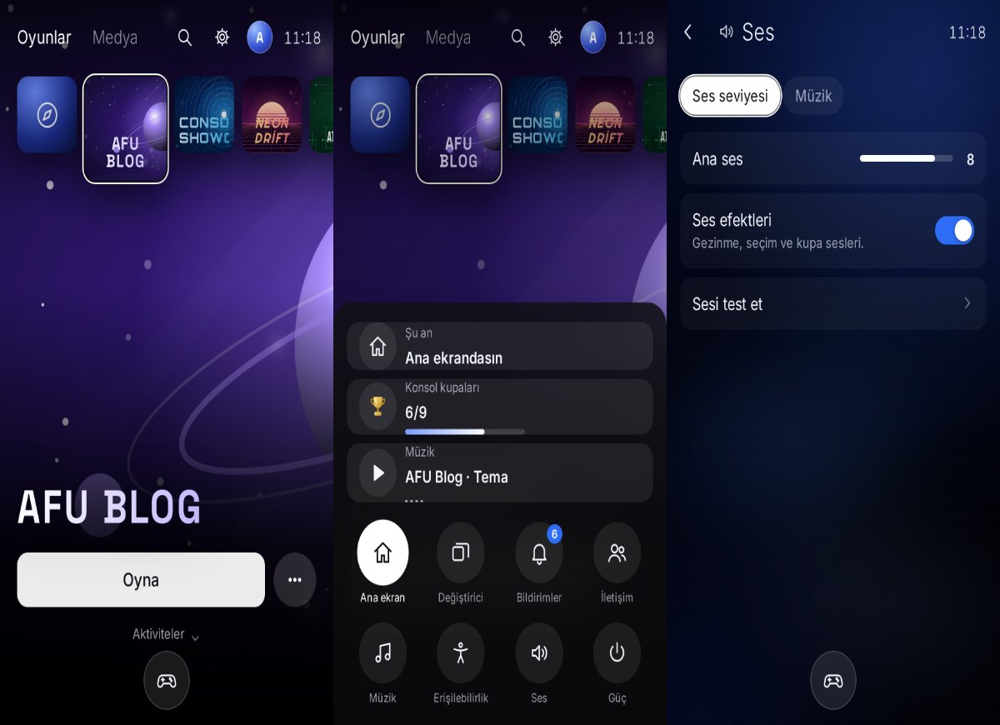 |
| **Profil (Keşfet).** CV: deneyim, yetenekler, eğitim, diller. | **Telefonda.** Ana ekran, kontrol merkezi ve ayarlar. |

## Konsoldaki karşılıkları

| Konsolda | Portfolyoda |
| --- | --- |
| Açılış ve "Kumandayı kim kullanıyor?" | Karşılama; Misafir, Sahip ve İşe alım (doğrudan CV'ye gider) |
| Oyunlar sırası | Projeler; her biri kendi oyun sayfasına açılır |
| Oyun sayfası | Açıklama, özellikler (Aktiviteler), teknolojiler, proje kupaları, galeri, demo ve kaynak kod |
| Keşfet / Profil | CV: deneyim, yetenekler, eğitim, diller, oynanan oyunlar |
| Kupalar | Sertifikalar ve ödüller + ziyaretçinin gezerken kazandığı konsol kupaları |
| Oyun Kütüphanesi | Tüm projeler, duruma göre filtreli |
| Medya | Blog yazıları, eğitimler, konuşmalar ve sosyal bağlantılar |
| Kontrol merkezi | Son açılan projeler, bildirimler, iletişim, müzik, erişilebilirlik, ses, güç |
| Ayarlar | Erişilebilirlik, ses, ekran, bildirimler, kullanıcılar, sistem, depolama, ağ, aksesuarlar |
| Arama | Projeler, yazılar ve bağlantılar arasında arama |
| Oluştur (Create) tuşu | Bağlantıyı kopyala, paylaş, tam ekran |

## Kontroller

| | Klavye | Kumanda | Dokunmatik |
| --- | --- | --- | --- |
| Gezin | Oklar / WASD | Yön tuşları, sol çubuk | Kaydır |
| Seç | Enter / Boşluk | ✕ | Dokun (seçili karoya tekrar dokun) |
| Geri | Esc / Backspace | ○ | Sol üstteki geri oku |
| Kontrol merkezi | P | PS tuşu | Alttaki yuvarlak düğme |
| Seçenekler (oyunun … menüsü) | M | Options | `…` düğmesi |
| Oluştur menüsü | C | Create | |
| Önceki / sonraki sekme | Q / E | L1 / R1 | Sekmeye dokun |
| Ara (ana ekranda) | T | △ | Üstteki büyüteç |

PS tuşunu tarayıcıya iletmeyen kumandalarda (ör. bazı Xbox kumandaları) Options tuşu, kendi menüsü olmayan ekranlarda
kontrol merkezini açar. Fareyle tekerlek de çalışır: ana ekranda aşağı/yukarı kaydırma kartlara iner, yatay kaydırma (veya Shift + tekerlek)
kutucuklar arasında gezer. Ayarlar → Aksesuarlar → Klavye sayfasında aynı tablo konsolun içinde de var.

## Ayarlar

Ayarlar tarayıcıda (`localStorage`) saklanır ve bir sonraki ziyarette geri gelir.

| Kategori | Neler var |
| --- | --- |
| Erişilebilirlik | Yazı boyutu (tüm arayüzü büyütür), yüksek kontrast, hareketi azalt, kumanda titreşimi |
| Ses | Ana ses seviyesi, ses efektleri, sesi test et, arka plan müziği, parça seçimi, oyun temaları |
| Ekran ve görüntü | Sistem teması (Kozmik, Kuzey ışığı, Kor, Gece), dalga arka planı, tam ekran, 12/24 saat |
| Bildirimler | Açılır bildirimler, bildirim geçmişini temizle |
| Kullanıcılar ve hesaplar | Kullanıcı değiştir, konsol kupalarını sıfırla |
| Sistem | Dil, belirli bir süre sonra ekranı karart, sistem bilgisi, varsayılan ayarlara dön |
| Depolama | Projelerin "yüklü oyun" boyutları ve kayıtlı verilerin kapladığı yer |
| Ağ | Bağlantı durumu, gecikme ölçen internet testi, bağlantı türü |
| Aksesuarlar | Canlı kumanda şeması, titreşim testi, klavye/kumanda tuş tablosu |

## İçeriği değiştirmek

Her şey tek dosyada: `content/portfolio.ts`.

- `profile`: CV bilgileri. `level` yıl deneyimi olarak gösterilir.
- `projects`: her proje bir "oyun". `palette` ve `motif` kapak görselini belirler
  (`orbit`, `grid`, `waves`, `shards`, `rings`, `dunes`, `city`, `circuit`), `logo` başlığın yazı tipini.
  `hours` hem geliştirme süresi hem de Depolama sayfasındaki "oyun boyutu" olur.
- `achievements`: sertifikalar, ödüller, kilometre taşları.
- `media`: yazılar ve eğitimler. `socials`: iletişim bağlantıları (kontrol merkezindeki İletişim kartında da çıkar).

Gerçek görsel kullanmak için resimleri `public/projects/` altına koyup projeye `cover` (kare karo), `hero` (geniş arka plan)
ve `screenshots` (galeri ve aktivite kartları) alanlarını ekle, örneğin `cover: "/projects/neon-drift.jpg"`.
Resim verilmeyen yerlerde üretilen kapak sanatı kullanılır.

`sample: true` işaretli girdiler örnek içeriktir ve ekranda "Örnek içerik" rozetiyle görünür; kendi bilginle değiştirince bayrağı sil.
`#` olan bağlantılar açılmaz, "Bu bağlantı henüz eklenmedi" der.

## Çalıştırma

```bash
cd ps5-showcase
npm install
npm run dev        # http://localhost:3100
npm run typecheck
npm run build
npm run preview    # preview/index.html: kurulum gerektirmeyen tek dosyalık sürüm
```

`preview/index.html` tarayıcıda doğrudan açılabilir; içeriği değiştirdikten sonra `npm run preview` ile yenile.

Bu klasör kökteki blogdan bağımsızdır. Vercel'de ayrı bir proje olarak yayınlamak için "Root Directory" olarak `ps5-showcase` seçilir.

## Proje yapısı

```
app/                    Next.js giriş noktası ve tüm stiller (globals.css)
components/
  Console.tsx           Ekranlar arası geçiş, geri yığını, oyun açılış animasyonu
  Overlays.tsx          Kontrol merkezi, Oluştur menüsü, ekran karartma, bağlantı açılış ekranı
  screens/              Home, Pages (oyun, profil, kupalar, kütüphane), Settings, Search, System (açılış, kullanıcılar, güç)
  CoverArt.tsx          Paletten üretilen SVG kapak sanatı
  Icons.tsx, ui.tsx     İkonlar ve ortak parçalar
content/portfolio.ts    Bütün içerik
lib/
  console.tsx           Ayarlar, kupalar, bildirimler (localStorage'a kaydedilir)
  input.tsx             Klavye, fare, dokunmatik ve kumanda için tek girdi modeli
  sound.ts              Web Audio ile sentezlenen sesler ve müzik
  nav.ts, i18n.ts       Izgara odaklama ve çeviriler
```

## Teknik notlar

- **Girdi katmanları:** her ekran ve açılır pencere bir katman kaydeder; tuşları yalnızca en üstteki alır. Arama ekranı
  katmanı yazı da alır, böylece aynı ekran hem ekran klavyesiyle hem fiziksel klavyeyle çalışır.
- **Ses:** gezinme, seçim, açılış ve kupa sesleri, ayrıca arka plan müziği tamamen osilatör ve üretilmiş yankıyla yapılır.
  Oyun temaları projenin kimliğinden türetilen bir akorla çalar, yani her proje her zaman aynı tınlar.
- **Ölçek:** tüm boyutlar 16:9'a göre ayarlanan tek bir birimle (`--u`) verilir; arayüz TV gibi ölçeklenir,
  "Büyük yazı" ayarı bu birimi büyütür. Telefonlar için ayrı ölçüler var.
- **Kalıcılık:** ayarlar, kazanılan kupalar ve son açılan projeler `localStorage`'da tutulur; depolama kapalıysa uygulama yine çalışır.
